# Advanced Maze Solver

This is our project for Lab 1 - Searching algorithms of the course Introduction to AI at HCMUS.

Content:
- [**1. Project description**](#project-description)
- [**2. Maze solving**](#maze-solving)
    - [**2.1. Normal maze**](#normal-maze)
    - [**2.2. Bonus maze**](#bonus-maze)
    - [**2.3. Intermediate maze**](#inter-maze)
    - [**2.4. Teleport maze**](#teleport-maze)

## 1. Project description

In this project, we mentioned about 2 types of searching algorithms:
- **Uninformed Search:**
    - Depth First Search (DFS)
    - Breadth First Search (BFS)
    - Uniform-Cost Search (UCS)
- **Informed Search:**
    - Greedy Best First Search (GBFS)
    - A*

About the maze, we have 3 types:
- **Normal maze:** We need to find the optimal path from the START node (orange) and END node (blue).
    

    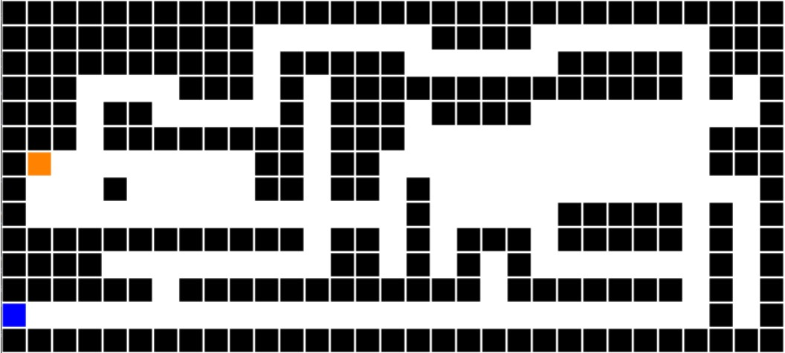</img>
    

- **Bonus maze**: There will be some nodes with bonus point on the maze, called bonus nodes. The output path should have the cost as low as possible.
    

    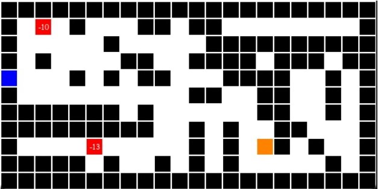</img>
    

- **Intermediate maze**: There will be some nodes that we have to reach before ending the path.
    

    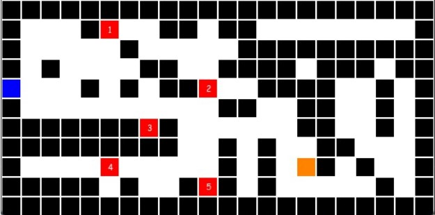</img>
    

- **Teleport maze**: This type of maze will have some teleport nodes (from `(x, y)` to `(x', y')` and vice versa).
    

    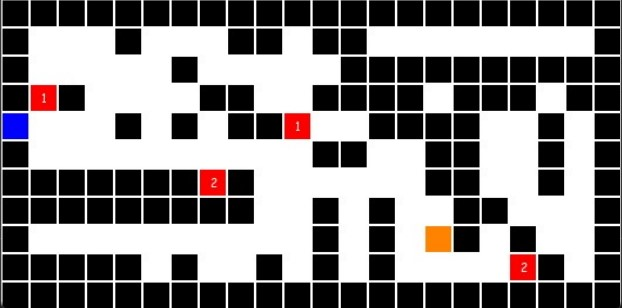</img>
    

## 2. Maze solving

- some words
- use gifs, put in the `readme-resources/gifs` folder
 
### 2.1. Normal maze

#### 2.1.1. DFS algorithm

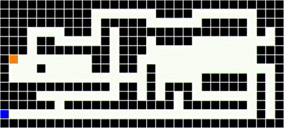

#### 2.1.2. BFS algorithm

#### 2.1.3. UCS algorithm

#### 2.1.4. GBFS algorithm

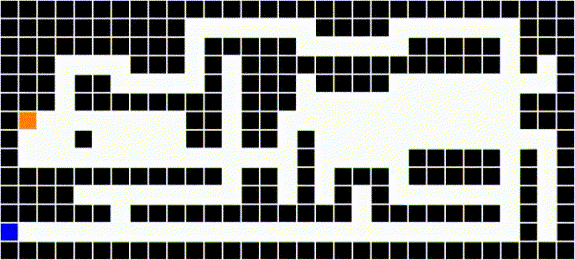

With Manhattan distance as heuristic function

With Euclidean distance as heuristic function

#### 2.1.5. A* algorithm

With Manhattan distance as heuristic function

With Euclidean distance as heuristic function

### 2.2. Bonus maze

- We used A* algorithm with the following heuristic function, calculated on the current node $n$:

$$h(n)=\min_{b \in Specials} \left ( M(n, b) + value(b) + M(b, end) \right )$$
- With: 
   - $Specials$ is the set of nodes, included END node and all the bonus nodes at the moment we calculated the value of $h(n)$; 
    - $M(n, b)$ is the Manhattan distance between node $n$ and node $b$;
    - $value(b)$ is the value of bonus point at node $b$;
    - $end$ is the END node.

- Animated output examples below:

    - Map #1:
    

    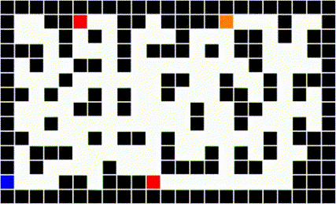
    

    - Map #2:
    

    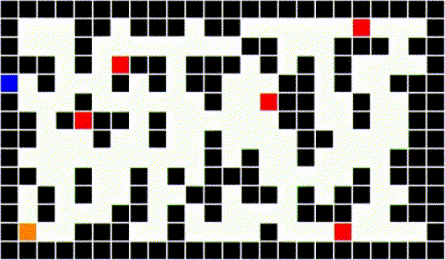
    

### 2.3. Intermediate maze

- We also used A* algorithm with the following heuristic function, calculated on the current node $n$:

$$h(n) = \left\{
        \begin{matrix}
            M(n, end)) & \text{, if } Inters = \varnothing 
            \\ 
            \min_{b \in Inters} \left ( M(n, b) \right ) & \text{, otherwise} \hspace{1.25cm}
        \end{matrix}
    \right.$$
    
- With:
    - $Inters$ is the set of nodes, included all the intermediated nodes presented at the moment we calculated the value of $h(n)$.
    - $M(n, b)$ and $end$ are mentioned [above](#manhattan).

- Animated output examples below:
    - Map #1:
    

    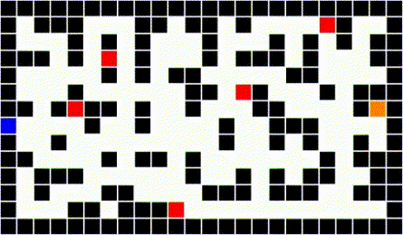
    

    - Map #2:
    

    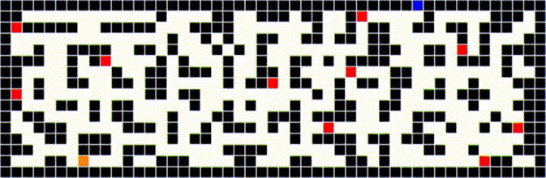
    

### 2.4. Teleport maze

- In this maze, when we are at node $n$ with coordinate $(i,j)$, we are able to reach up to 5 other nodes instead of 4, included $(i, j+1)$, $(i, j-1)$, $(i+1, j)$, $(i-1, j)$, and $(i', j')$ is the relevant teleport nodes.

- We simply choose the BFS algorithm to search for the path in this scenario because it seems to work very well.

- We also used A* algorithm with the following heuristic function, calculated on the current node $n$:

$$h(n) = \min_{t \in Specials} \left ( M(n, t) + \min(M(t, end), M(t', end)) \right ) $$
    
- With:
    - $M(n, b)$ and $end$ are mentioned [above](#manhattan).
    - $t'$ is the teleport node paired with node $t$.
    - $Specials$ is the set of nodes, included all the teleport nodes and the END node (noted that this set included both node $t$ and node $t'$).

- Animated output examples below:
    - Map #1:

    

    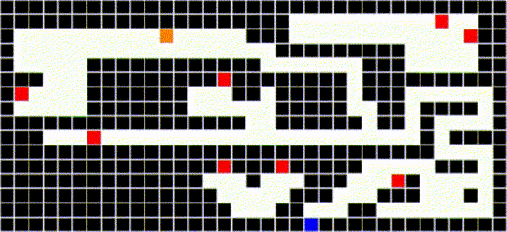
    
With BFS algorithm

    

    

    
    
With A* algorithm

    

    - Map #2:
    

    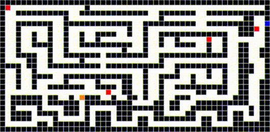
    
With BFS algorithm

    

    

    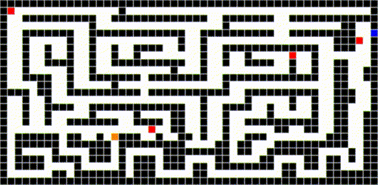
    
With A* algorithm

    

